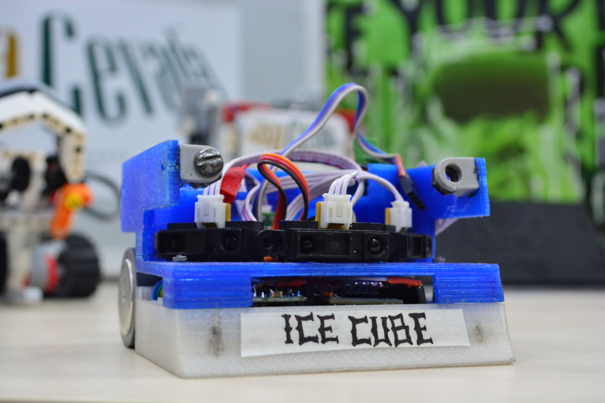

# Ice Cube

O Ice Cube, é um robô que está sendo criado dentro do GERSE , afim de participar da Winter Challenge 2019 na modalidade de robô sumo autônomo (500g). O mesmo consiste em uma estrutura construida de PLA por meio de uma impressora 3D com a rampa  de aluminio, seu circuito eletronico é constituido por sensores sharp e o TCRT 5000 os quais enviam dados ao arduino nano.

-c8908fef-fb44-4726-a7ee-6ff4da8cfbdd.png)

## **Circuito**
 
O circuito foi desenvolvido em Kicad e está projetado para fabricação manual (transferência térmica) embora o **[GERBER](circuito/PCB)** para fabricção manofaturada tambem está disponivel ([PDF](circuito/PCB/PCB.pdf))   para mais detalhes vejam o [Esquema elétrico](https://github.com/gerse-ifsp-campus-guarulhos/Ice-Cube/blob/master/circuito/Documentacao/esquematico.pdf), a placa contém:
 
* Fonte DCDC
* Driver ponte H
* Placa Pill Blue (arm)
* Conectores Molex para motores, sensores e alimentação
* E um bluetooth (**PARA AJUDAR NO DEBUG**)
 
O bluetooth está aí para ajudar no desenvolvimento do programa e não vais estar conectado na placa no momento da competição, o conector dele pode ser usado como botão para iniciar o robô (um jumper que desencaixa ).

## Projeto Final 

- O reultado final foi o robo abaixo que competiu na na winter challenge concórdia.

